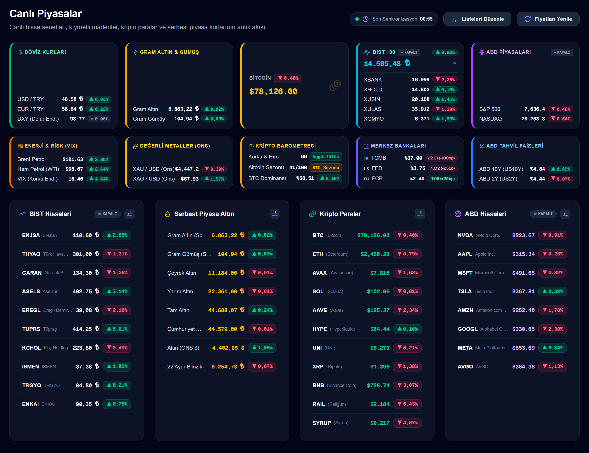
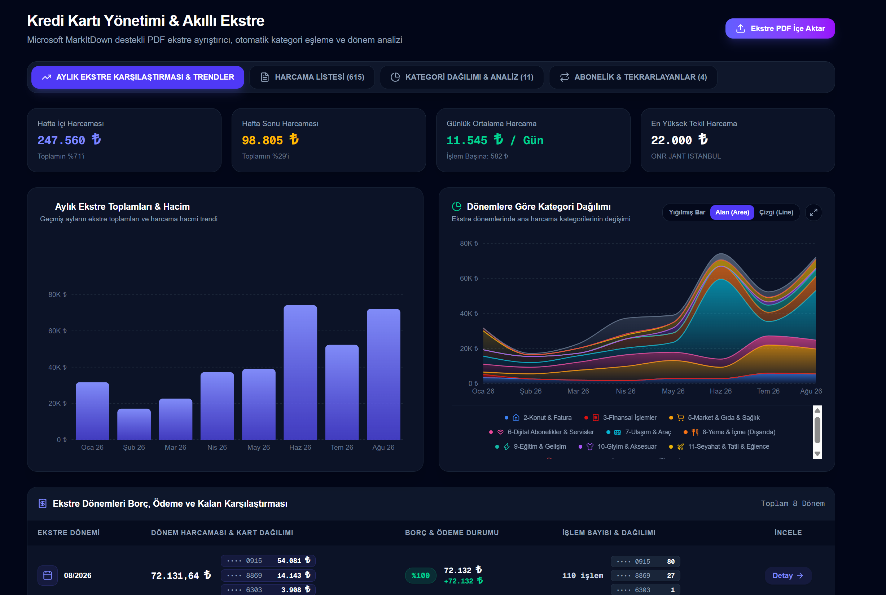
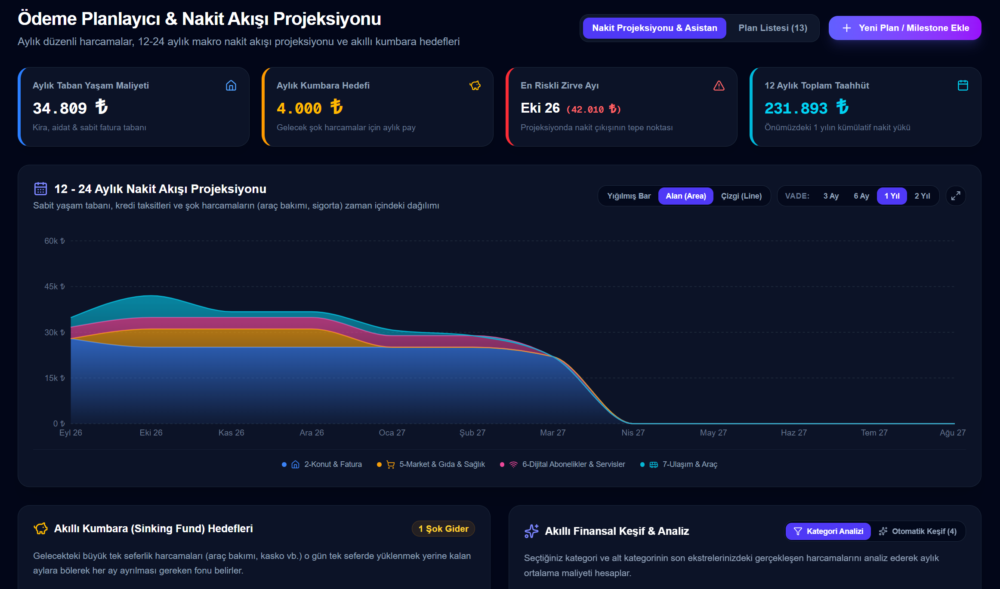
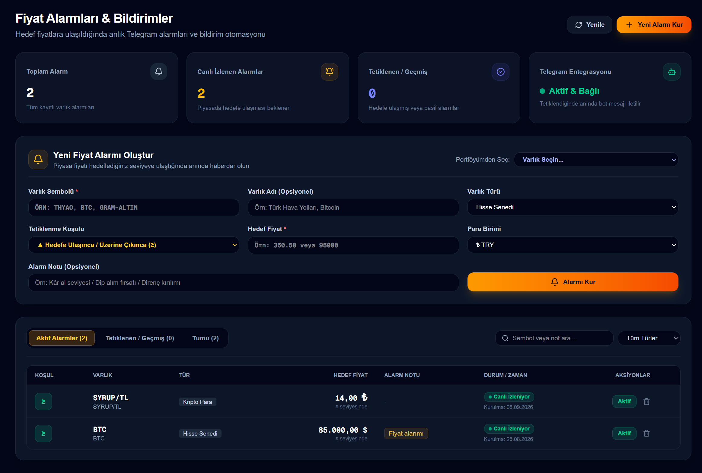
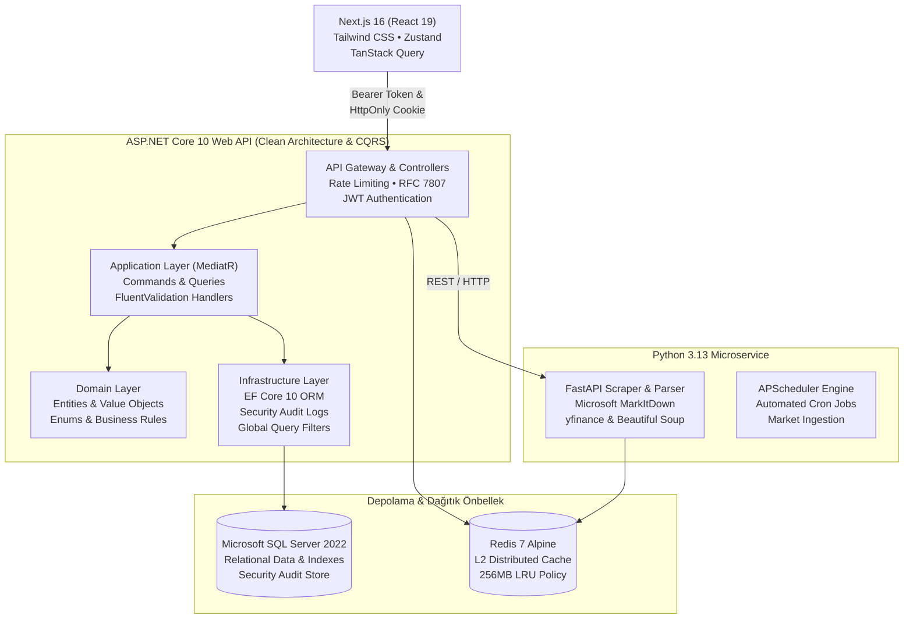

<div align="center">

# 💳 SpendLog — Kurumsal Finans & Varlık Yönetimi Platformu

**Yapay zekâ destekli kredi kartı ekstre ayrıştırıcı, 12-24 aylık nakit akışı projeksiyonu, canlı çoklu varlık portföy takibi ve multi-bot Telegram entegrasyonu sunan kurumsal FinTech ekosistemi.**

---

[](https://dotnet.microsoft.com/)
[](https://nextjs.org/)
[](https://react.dev/)
[](https://python.org/)
[](https://fastapi.tiangolo.com/)
[](https://www.docker.com/)
[](https://www.microsoft.com/sql-server)
[](https://redis.io/)
[](https://tailwindcss.com/)

[Temel Özellikler](#-temel-özellikler) • [Sistem Mimarisi](#-sistem-mimarisi) • [Hızlı Kurulum (Docker)](#-hızlı-kurulum-docker) • [Güvenlik Standartları](#-kurumsal-güvenlik-standartları) • [Teknoloji Yığını](#-teknoloji-yığını)

</div>

---

## 🌟 Projeye Genel Bakış

**SpendLog**, bireysel ve kurumsal kullanıcıların dağınık finansal varlıklarını tek bir yüksek performanslı komuta merkezinde toplayan yeni nesil bir varlık ve bütçe yönetim platformudur. 

Geleneksel bütçe uygulamalarından farklı olarak; **Clean Architecture**, **CQRS (Command Query Responsibility Segregation)**, **Microsoft MarkItDown destekli akıllı PDF ayrıştırma**, **L1/L2 hibrit dağıtık önbellek** ve **banka düzeyinde güvenlik** standartları üzerine inşa edilmiştir.

---

## 📸 Görsel Vitrin (Ekran Görüntüleri)

> *Ekran görüntüleri `./docs/screenshots/` dizininde yer almaktadır.*

<div align="center">
  <table>
    <tr>
      <td width="50%">
        
        <p align="center"><b>Canlı Finans Piyasaları & Göstergeler</b><br><i>BIST 100, döviz, serbest piyasa altın, kripto paralar ve küresel piyasalar</i></p>
      </td>
      <td width="50%">
        
        <p align="center"><b>Kredi Kartı Yönetimi & Akıllı Ekstre</b><br><i>Microsoft MarkItDown motoru, ekstre karşılaştırma, harcama hacmi ve alan trendleri</i></p>
      </td>
    </tr>
    <tr>
      <td width="50%">
        
        <p align="center"><b>12 - 24 Aylık Nakit Akışı Projeksiyonu</b><br><i>Taban yaşam maliyeti, gölgeli alan projeksiyonu, riskli zirve ayı ve kumbara hedefleri</i></p>
      </td>
      <td width="50%">
        
        <p align="center"><b>Fiyat Alarmları & Telegram Bildirim Merkezi</b><br><i>Hedef fiyat tanımlama, canlı piyasa izleme ve anlık Telegram bot tetiklemeleri</i></p>
      </td>
    </tr>
  </table>
</div>

---

## 🚀 Temel Özellikler

### 1. 📊 12 - 24 Aylık Nakit Akışı Projeksiyonu (Cash Flow Projection)
* Gelecek 24 ayın kümülatif nakit giriş ve çıkışlarını simüle eder.
* **Aylık Taban Yaşam Maliyeti:** Sabit yaşam taahhütlerini (kira, aidat, faturalar) otomatik hesaplar.
* **Nakit Darboğazı (Zirve Ayı) Tespiti:** Önümüzdeki 12 ay içinde nakit çıkışının zirve yapacağı ayı otomatik tespit ederek kullanıcıyı dashboard üzerinden uyarır.
* **Dinamik Grafik Modları:** Yığılmış Bar (Stacked Bar), Gölgeli Alan (Area) ve Çizgi (Line) görünümleri arasında tek tıkla geçiş; 3 Ay, 6 Ay, 1 Yıl ve 2 Yıl kurumsal vade filtresi.

### 2. 📑 Akıllı PDF Kredi Kartı Ekstre Ayrıştırıcı (Microsoft MarkItDown)
* Banka ekstrelerini (PDF) Microsoft MarkItDown motoru ile anında yapısal metne dönüştürür.
* Harcamaları, faizleri, taksit sayılarını ve son ödeme tarihlerini kuruşu kuruşuna ayrıştırır.
* **Gelişmiş Filtreleme:** Tek ay veya tüm dönemler genelinde çok terimli arama, kategori hiyerarşisi (33 finansal ikonlu) ve alt kategori analitiği.

### 3. 🤖 Multi-Bot Kişisel Telegram Finans Asistanı (Webhook Router)
* **Kişiselleştirilmiş Bot Bağlantısı:** Her kullanıcı `@BotFather` üzerinden kendi özel Telegram botunu bağlayabilir.
* **Sıfır-Thread Webhook Mimarisi:** Thread açmadan token secret rotası üzerinden anlık istek işleme.
* **Zengin Bot Komutları:** `/bakiye`, `/kk [tutar] [not]`, fiş fotoğrafı OCR analizi, `/yakit` ve limit uyarıları.

### 4. 📈 Canlı Finans Piyasaları, Portföy & Fiyat Alarmları
* BIST 100 hisse senetleri, Serbest Piyasa altın/döviz (Kapalıçarşı) ve Kripto varlıkları anlık izleme.
* **Portföy Yönetimi:** Alış maliyetleri, gerçekleşen (realize) kâr/zarar, TRY/USD bazında portföy değeri.
* **Excel İçe / Dışa Aktar:** `.xlsx`, `.csv` ve kurumsal yazdırma / PDF motoru desteği.
* **Fiyat Alarmları:** Portföydeki varlıklar için hedef fiyat koşulu (`>=` veya `<=`) tanımlama ve Telegram tetiklemesi.

### 5. ⛽ Akaryakıt & Araç Tüketim Radarı
* Akaryakıt fişlerinin tepesindeki el yazısı kilometre verisini işleme.
* Ardışık yakıt alımları üzerinden **₺/Km** ve **Lt/100Km** ortalama araç tüketimini arka planda otomatik hesaplama.

---

## 🏗️ Sistem Mimarisi

SpendLog, katı **Clean Architecture** prensipleri ve gevşek bağlı mikroservis mimarisi ile inşa edilmiştir:



---

## 🔒 Kurumsal Güvenlik Standartları

FinTech ve bankacılık güvenlik standartları gereği sistem aşağıdaki savunma hatlarıyla donatılmıştır:

* **3 Hatalı Girişte 15 Dakika Hesap Kilitleme (Account Lockout):** Brute-force saldırılarına karşı ardışık 3 hatalı denemede hesap otomatik olarak kilitlenir; kalan hak ve süre dinamik bildirilir.
* **ASP.NET Core Rate Limiting:** `/api/auth/login` ve `/api/auth/register` uç noktalarında IP başına dakikada maksimum 5 istek sınırı (`429 Too Many Requests`).
* **HttpOnly Cookie Tabanlı Refresh Token & Token Rotation:** XSS saldırılarına karşı `HttpOnly; SameSite=Lax; Path=/api/auth` güvenli çerez mimarisi. Eski token'ların tekrar kullanımı (çalınma) anında tespit edilerek oturumlar sonlandırılır.
* **15 Dakikalık Access Token:** Kısa ömürlü JWT belirteçleri ve `ClockSkew = 0` ile anında zaman aşımı garantisi.
* **Veritabanı Güvenlik Denetim Günlüğü (Security Audit Log):** SQL Server üzerinde tüm başarılı/başarısız girişler, kilitlenme olayları, IP adresleri ve User-Agent bilgileri anlık loglanır.
* **Multi-Tenant Katı Veri İzolasyonu:** EF Core `Global Query Filter` ile her kullanıcının verisi veritabanı düzeyinde mutlak olarak izole edilir.

---

## 🚀 Hızlı Kurulum (Docker)

Projeyi bilgisayarınızda **sıfır konfigürasyon** ile (runtime kurmadan) çalıştırmak için tek ihtiyacınız [Docker Desktop](https://www.docker.com/)'tır.

### 1. Repoyu Klonlayın
```bash
git clone https://github.com/kullanici-adiniz/spendlog.git
cd spendlog
```

### 2. Ortam Değişkenlerini Tanımlayın (Opsiyonel)
```bash
cp .env.example .env
```
*(Varsayılan değerlerle doğrudan çalışmaya hazırdır).*

### 3. Tek Komutla Başlatın
```bash
docker compose up -d --build
```

Konteynerler hazır olduğunda:
* 🌐 **Web Arayüzü (Frontend):** `http://localhost:3000`
* 🔌 **Backend API (.NET 10):** `http://localhost:5007`
* 🕷️ **Scraper & PDF Docs (FastAPI):** `http://localhost:8000/docs`

### 🔑 Varsayılan Hazır Test Hesabı
Veritabanı otomatik migrate edilir ve ilk açılışta hazır yönetici hesabı tohumlanır:
* **E-posta:** `admin@spendlog.com`
* **Şifre:** `Admin123*`

---

## 🛠️ Yerel Geliştirici Modu (Manual Setup)

Konteyner kullanmadan yerel ortamınızda geliştirme yapmak isterseniz:

### Önkoşullar
* [.NET 10 SDK](https://dotnet.microsoft.com/)
* [Node.js 20+ / npm](https://nodejs.org/)
* [Python 3.12+](https://www.python.org/)
* Yerel Microsoft SQL Server ve Redis

### 1. Veritabanı & Redis Altyapısını Başlatın
```bash
docker compose up -d spendlog-db spendlog-redis
```

### 2. Backend API (.NET 10)
```bash
cd backend/SpendLogV2.API
dotnet run --urls http://localhost:5007
```

### 3. Scraper Mikroservisi (Python FastAPI)
```bash
cd scraper-service
python -m venv venv
# Windows:
.\venv\Scripts\activate
# Linux/Mac:
source venv/bin/activate

pip install -r requirements.txt
uvicorn main:app --host 0.0.0.0 --port 8000 --reload
```

### 4. Frontend Web (Next.js 16)
```bash
cd frontend
npm install
npm run dev
```

*(Windows kullanıcıları yerel geliştirme için kök dizindeki `start-all.bat` ve `stop-all.bat` scriptlerini de kullanabilir).*

---

## 💻 Teknoloji Yığını

| Alan | Teknoloji / Kütüphane | Kullanım Amacı |
| :--- | :--- | :--- |
| **Backend API** | .NET 10.0 (C#) | Yüksek performanslı kurumsal RESTful API |
| **Mimari Desen** | Clean Architecture, CQRS, MediatR | Katmanlı mimari ve gevşek bağlı iş mantığı |
| **ORM & Veritabanı** | Entity Framework Core 10, MSSQL 2022 | Code-First ilişkisel veri modelleme, migrasyonlar |
| **Frontend Framework** | Next.js 16.3 (Turbopack, App Router) | Sunucu ve istemci bileşenleri, SSR/CSR hibrit |
| **UI & Stil** | React 19, Tailwind CSS, Lucide React | Modern obsidian cam (glassmorphism) arayüz tasarımı |
| **Mikroservis & AI** | Python 3.13, FastAPI, Uvicorn | Harici piyasa kazıma ve ekstre OCR/PDF ayrıştırma |
| **PDF Motoru** | Microsoft MarkItDown (`markitdown`) | Banka ekstrelerini Markdown formatına dönüştürme |
| **Önbellek (Caching)** | Redis 7 Alpine, `cachetools` | L1 In-Memory + L2 Dağıtık önbellekleme (Safe Fallback) |
| **Zamanlayıcı** | APScheduler | Arka planda periyodik borsa ve altın fiyat çekimi |
| **Konteynerizasyon** | Docker, Docker Compose | Çoklu konteyner tam yığın orkestrasyonu |

---

## 📄 Lisans

Bu proje [MIT Lisansı](LICENSE) altında korunmaktadır. Ticari ve kişisel amaçlarla özgürce incelenebilir ve kullanılabilir.

---

<div align="center">
  <sub>SpendLog Platformu — Kıdemli Yazılım Mimarisi ve FinTech Standartlarıyla Geliştirilmiştir.</sub>
</div>
